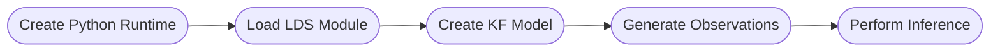
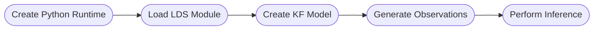

# Bonsai Documentation

[](https://github.com/bonsai-rx/docs/actions/workflows/build.yml)

This repo contains the technical reference manual for the Bonsai visual programming language, in addition to articles and examples that document the collective knowledge of the Bonsai user community.

> [!NOTE]  
> This repo hosts the documentation for the base Bonsai library. Documentation for each new Bonsai package will be hosted in its own repo, for instance, https://github.com/bonsai-rx/machinelearning. The instructions below apply to both documentation for the base Bonsai library as well as new packages.

Documentation is built using DocFx, a static site generator that automatically generates API documentation for .NET projects and deployed using a Github Actions workflow on Github Pages.

# Would you like to contribute to documentation?

## Step by step guide to contributing to existing documentation

These instructions apply to repos that already have a DocFx website created.

1. Fork the `main` branch of the repository you want to contribute documentation to.
2. Download and install the latest stable version of [DocFx](https://dotnet.github.io/docfx/index.html) (currently 2.75.3).
3. In a Windows Powershell, use the command `docfx docfx.json --serve` to generate a local preview of the documentation website as you make changes.

> [!NOTE]  
> Occasionally, we run into weird bugs with the local preview. Check if the error persists by publishing your fork online.

4. When you are ready to have your contribution reviewed, commit your edits to the approriate branch of your fork and create a pull request to merge that branch with the "main" branch of the original repo.
5. Community members will be assigned to review the PR and @glopesdev will conduct the final review and quality control check. If the contribution passes this final step, the PR to merge with "main" will be approved and the contribution will be published.


## Step by step guide to setting up new documentation

For packages without existing documentation, a new DocFx website needs to be initialized.

1) In Windows Powershell, setup a local installation of DocFx in the repo with the following commands (executed in the root directory of the repo). 

```powershell
dotnet new tool-manifest 
dotnet tool install --local docfx --version 2.75.3
```

2) Create a new `docs` folder to host the documentation files. Navigate to folder and initialise a new DocFx website with the following command.

```powershell
dotnet docfx init 
```

3) Select these options for the new website
```powershell
Name (mysite): Bonsai - Package Name
Generate .NET API documentation? [y/n] (y): y
.NET projects location (src): src
Markdown docs location (docs): articles
Enable site search? [y/n] (y): y
Enable PDF? [y/n] (y): n
```
This creates a docfx.json file in the "docs" folder that hosts the configuration options for the website. From here on out we just need to make a few tweaks to docfx.json as well as copy over some additional files and folders.

4) Configuring docfx.json - most of the parameters to be changed can be copied over from the docfx.json in a repo that has been recently updated (for instance https://bonsai-rx.org/machinelearning/). A few of the important changes are explained here (not exhaustive).

```yml
"metadata": [
    {
        "filter": "filter.yml"
    }
]
```

This uses the filter.yml file to filter out obsolete nodes in the package from the documentation that have been included for compatibility purposes (but are no longer supported).

```yml
"resource": {
    "files": [
        "logo.svg",
        "favicon.ico",
        "images/**",
        "workflows/**"
    ]
}
```

List any additional files/folders that are to be used in the docs needs to be added here

```yml
"globalMetadata": {
    "_appName": "Bonsai - PackageName",
    "_appTitle": "Bonsai.PackageName",
    "_appFooter": "&copy; 2024 Bonsai Foundation CIC and Contributors. Made with <a href=\"https://dotnet.github.io/docfx\">docfx</a>",
    "_gitContribute": {
        "repo": "https://github.com/bonsai-rx/PackageName",
        "branch": "main",
        "apiSpecFolder": "apidoc"
    }
}
```
Change PackageName and github link to the repo being worked on and add footer information

```yml
"template": [
    "default",
    "modern",
    "bonsai/template",
    "template"
]
```
This applies CSS patches to enable custom workflow containers

```yml
"xref": [
    "https://bonsai-rx.org/docs/xrefmap.yml",
    "https://horizongir.github.io/reactive/xrefmap.yml"
]
```
This allows for cross reference of operators and properties across the different Bonsai docs websites


5) In the "docs" folder, create these folders.

```markdown
* articles - this will host markdown files for various articles that will go into the "Manual" documentation
* apidoc - this will host markdown files for individual Bonsai operators or properties that will go into the "Reference" documentation.
* images - this will host images for the website.
* workflows - this will host .bonsai files for example workflows. 
```

6) Copy over these files from a repo that has been recently updated, and place them in the root folder of the repo. Amend the files as necessary. 

```markdown
* .github folder - this includes a workflows/docs.yml file that is a Github Actions workflow recipe to build the DocFx website. 
If one already exists, make sure that it is updated to the latest version and change the package name parameters

* .bonsai folder -this includes the files necessary to build a Bonsai environment on Github Actions.
    * The config.yml file in the .bonsai folder needs to be amended to include any packages that are necessary for running the SVG export for sample Bonsai workflows on Github Actions (see below for more details).
    * The new Bonsai package itself does not need to be included.

* .gitignore file - this needs to be updated to ignore some of the new workflow files (like the .bonsai packages env)
```

7) Copy the rest of these folders and files into the "docs" folder

```markdown
* docs/filter.yml file - this filters out obsolete operators from being included in API documentation.
* docs/.gitignore file - this filters out the _site folder that is generated during local preview
* docs/favicon.ico and logo.svg - files for site logo and bookmark icon
* docs/workflows/.gitignore file - this ignore bonsai layout files and svg files 
* docs/build.ps1 file - this script is used to export images for sample workflows
    * amend the line in the file to the new package name and source location.
* docs/template/public folder- this should contain main.css and main.js which are patches for the default template and utilise the docfx-tools submodule.
    * amend main.js to change the github link to the current repository.
```

8) Add the [docfx-tools]() submodule. This submodule contains scripts for automating SVG export from sample workflows and patches the DocFx CSS templates to add workflow containers. 
```
git submodule add https://github.com/bonsai-rx/docfx-tools docs/bonsai
```

# Testing Unpublished Packages
To write documentation for new packages or releases that have not been published to the community, you can test them in Visual Studio. 
(adapted from https://bonsai-rx.org/docs/articles/create-package.html)

1) Install Visual Studio (the community edition can be installed for free)
2) Install Bonsai VS Extensions
3) In Visual Studio, open `src/PackageName.sln` in the repo
4) Press F5 to open the Bonsai editor with the new package added. 
5) From here, you can make Bonsai workflows and save them as per normal.


# Creating and Editing Articles

## Contributor Style Guide 

> [!NOTE]  
> When working on an article, first check [the old documentation](https://bonsai-rx.org/docs/) to see what written material might already exist for that topic. 

### Table of contents

* Introduction/Overview/Landing page - the first page of the docs website will be the index.md file that is located in the docs folder.  This typically includes a description of what the package does,  installation instructions (if its not too complicated) and acknowledgements. To make this page be the first page that is loaded on the docs website, in the articles/toc.yml file, the introduction page should be listed as shown.

### Standard formatting for operators and operator properties

When referring to operators (also known as nodes in Bonsai), place them inside a pair of backticks  (`` 'Operator_name' ``) so that the node names render as in code snippet formatting (i.e. ``CameraCapture``). Link the name to the relevant documentation in the code base, using the [markdown syntax for xref in DocFX](https://dotnet.github.io/docfx/tutorial/links_and_cross_references.html). 

When referring to operator properties, simply place the operator property name inside a pair of backticks (`` 'Operator_property_name' ``). 

For example, the `DigitalOutput` node is part of the `Bonsai.Arduino` namespace/package, and contains a property called `PortName`. To reference this specific property you need to specify the full path to it including namespace, operator name and property name, like so: `xref:Bonsai.Arduino.DigitalOutput.PortName`. 

To find out the full path for any node, right-click on the operator of interest in Bonsai and select the option "Go to Definition" or hit F12. The xref will be the namespace + operator name + (optionally) property name.

**Example:**

```markdown
### **Exercise 7:** Control an LED


- Insert a [`Boolean`](xref:Bonsai.Expressions.BooleanProperty) source.
- Insert a [`DigitalOutput`](xref:Bonsai.Arduino.DigitalOutput) sink.
- Set the `Pin` property of the [`DigitalOutput`](xref:Bonsai.Arduino.DigitalOutput) operator to 13.
- Configure the `PortName` property.
- Run the workflow and change the `Value` property of the [`Boolean`](xref:Bonsai.Expressions.BooleanProperty) operator.
- **Optional:** Use your mouse to control the LED! Replace the [`Boolean`](xref:Bonsai.Expressions.BooleanProperty) operator by a `MouseMove` source (hint: use `GreaterThan`, `LessThan`, or equivalent operators to connect one of the mouse axis to [`DigitalOutput`](xref:Bonsai.Arduino.DigitalOutput).
```

### Bonsai Workflows

To include and/or reference an example workflow in an article of the documentation, first create the example workflow in a Bonsai workflow editor and save the workflow as `articleFileName_workflowName`. 
Add the `.bonsai` file to the **workflows** folder in the repo. In the text of the article that includes/references this example workflow, add a workflow container.

**Example:**

Assuming you want to include `custom-pulse-train_send-custom-waveform.bonsai`: 

```markdown
:::workflow

:::
```

### Figures

> [!NOTE]  
> In general, we want to avoid images/screenshots when possible as they do not display well across light/dark themes and do not scale well across different display sizes and resolutions. See the following sections for alternative ways of creating different content.

To include a figure or image in an article: 
 - Save your figure or image as a `.svg` file, naming the file using the pattern `[article filename]-[figure name].svg`.
 - Add the figure/image to the **images** folder in the repo.
 - Reference the figure in the article with the following code.
 - For smaller screenshots, it may help to set a max width so that the fonts do not blow up too much on desktop displays. This can be done by setting a custom attribute on the img element directly like follows.

**Example:**

```markdown
{width=500}
```

{width=500}


### Diagrams and Charts

DocFX support the creation of flow charts and other diagrams using [Mermaid](https://mermaid.js.org/) syntax which may be helpful for visualising pipelines.

**Example:**

```markdown

```



### Property Tables

If you want to highlight certain properties to change for a particular application, they can be represented as [markdown pipe tables](https://docs.github.com/en/get-started/writing-on-github/working-with-advanced-formatting/organizing-information-with-tables).

**Example:**

``` markdown
| Category          | Property Name       | Value                  | Description
| ----------------  | ------------------- | ---------------------- | -------------------- | 
|  Pulse Timing     | `PulseTrainDelay`   | 0.0001 - 3600 (secs)   | The delay to start the pulse train. |
|  Pulse Timing     | `PulseTrainDuration`| 0.0001 - 3600 (secs)   | The duration of the pulse train.  |
```

| Category          | Property Name       | Value                  | Description
| ----------------  | ------------------- | ---------------------- | -------------------- | 
|  Pulse Timing     | `PulseTrainDelay`   | 0.0001 - 3600 (secs)   | The delay to start the pulse train. |
|  Pulse Timing     | `PulseTrainDuration`| 0.0001 - 3600 (secs)   | The duration of the pulse train.  |

### Final Polishing Steps

Delete redundant blank rows in between markdown lines and at the end of the articles. This improves code readability for future contributors.

# Publishing to Github Pages

Although this step is not necessary, it can be helpful if you want to check how your edits look online (and if the local preview is not working for some reason).

1) Setup a new branch called `gh-pages` on your fork of the repository.
2) Go to your repo settings -> `Pages` -> `Build and deployment` - under `Source` select `Deploy from a branch` and make sure `gh-pages` is selected.
3) Commit your edits and push to the `main` branch of your repo fork. 
4) Under the `Actions` tab of your github repo, trigger the `Build docs` workflow manually with the `Run workflow` button. This will build the docs site on the `gh-pages` branch.
5) Once the `Build docs` workflow has been completed, the `pages-build-deployment` workflow will run and publish your forked repo automatically.
7) The URL for the site can be found in your `Pages` section of your repo settings.