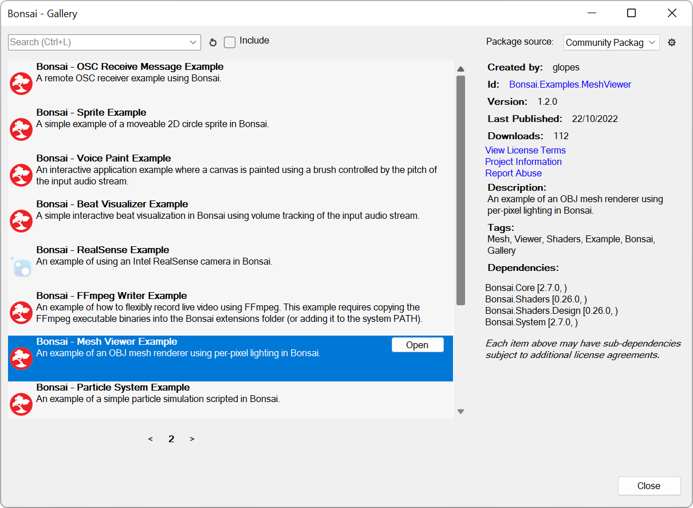

# Documentation Style Guide

Clear, well-organized documentation helps users understand package functionality, integrate it into their workflows, and troubleshoot effectively.

Through our experience documenting Bonsai, we've established several best practices for presenting information, which are outlined here alongside practical methods for implementation in [docfx](./documentation-docfx.md). This document is intended as a living resource, open to feedback and continuous improvement, rather than a static guide. Click on the `Edit this page` button or raise an issue on the [bonsai-docs](https://github.com/bonsai-rx/docs/issues) repository if you have a suggestion.

## Article organization

In general, we have found that three types of articles, organized into distinct website sections, are sufficient to address the needs of most users and their learning styles.

* Manual - hosts documentation that explains the basic workflow of the package or functions of the various operators.
* Reference - hosts technical documentation for each operator, generated automatically by DocFX from XML comments in source code or supplemented with individual operator articles.
* Tutorials - hosts examples or tutorials for various applications. This section is optional, but valuable for more complicated applications or packages which require operators from other packages for their execution.

To construct these 3 sections:

1) Ensure that the `docs` folder has a `articles` and `tutorials` folder. The `api` folder is automatically generated.
2) For the navigation bar at the top of the website, edit the `docs/toc.yml` file to reflect the location and name of the various folders.

```yml
- name: Manual
  href: articles/
- name: Reference
  href: api/
- name: Tutorials
  href: tutorials/
```
3) Add articles in markdown format to the `Manual` and `Tutorials` folder.
4) Add a toc.yml file to the `Manual` and `Tutorials` folder to generate the table of contents for that section. The `API` toc.yml is generated automatically.
Here is a sample `articles/toc.yml` with a flattened table of content layout (all articles will be visible in the TOC). This works best for most websites which do not have a lot of articles.

```yml
- href: ../index.md                         # Website Getting Started page that points to docs/index.md. Omit for tutorials/toc.yml
- name: LinearDynamicalSystems              # Group Heading (Optional)
- href: lds-overview.md                     # Article filename
- href: lds-installation-guide-windows.md
- href: lds-installation-guide-linux.md
```
> [!TIP]
> Setting up the link to the `Getting Started` page in this way avoids having to create a separate, redundant landing page.

> [!TIP]
> Article filenames should be simple and reflect either the article title or operator name. Titles can be omitted as they will be taken from the first `Heading 1` element.

Here is a same `toc.yml` but this time with a nested table of content layout (articles will only be visible when group headings are clicked). 

```yml
- href: ../index.md                         
- name: LinearDynamicalSystems              
  items:
  - href: lds-overview.md                    
  - href: lds-installation-guide-windows.md
  - href: lds-installation-guide-linux.md
```

### Manual section

For the `Manual` section we typically see these elements:

- Getting Started/Landing page - This typically includes a description of what the package does, how to install the package and funding/acknowledgements. This belongs in `docs/index.md`.
- Installation Instructions - If a package requires external dependencies or additional configuration it would be helpful to dedicate an extra page to this.
- Workflow/Conceptual Overview - Best illustrated with a flowchart or a basic workflow container. 

Beyond that, there are many possible ways to organise the rest of the manual articles depending on the type of package that is being supported. 

#### Individual operator articles

One approach that we recommend is to try and write articles for each individual operator. This approach has several advantages:

- individual operator articles can be integrated into the automatically generated `Reference` documentation using docfx's `overwrite` function, allowing for supplemental content like images and workflows.
- These articles can also be combined into larger conceptual `Manual` articles, providing organizational flexibility.
- Writing individual operator articles ensures complete coverage of all operators.

Creating an individual operator article requires some additional steps.
For example, to create an individual operator article for a `PredictPoses` operator that will be included in a "Network Inference" `Manual` article as well as in the automatically generated `Reference` doc:

1) Create the `Bonsai_Sleap_PredictPoses.md` article and place it in the `docs/apidoc` folder. To utilize the `overwrite` function, in the markdown file, assign a UID that follows the namespace.operator format. 

```yml
---
uid: Bonsai.Sleap.PredictPoses
---
Write content here.
```

2) Create a `Network-Inference.md` article and place it in the `docs/articles` folder. In the markdown file, include a reference to the individual operator.md file.

```markdown
Other 
[!include[Title](../apidoc/Bonsai_Sleap_PredictPoses.md)]
```
> [!NOTE]  
> The title is optional.

### Reference section

As mentioned the `Reference` section of the website is auto-generated from [XML documentation comments](https://learn.microsoft.com/en-us/dotnet/csharp/language-reference/xmldoc/recommended-tags) in the code. A unique feature we have integrated into the Bonsai Editor is that when users when users right click on individual operators they will be shown the `Reference` page for that operator. For many users, this might be the most obvious entry point to the package documentation. Thus it is essential that developers ensure that:

1) XML documentation comments are clear, simple and helpful.
2) Where appropriate, supplement additional information (basic workflow, images, long-form content) with an individual operator article using the `overwrite` function detailed in the previous section.

At present, we understand that the default template for the `Reference` page is a little too technically oriented, and somewhat confusing for Bonsai users to navigate. We are in the midst of revamping the template to cater to a broader audience and will update this section when it becomes availiable.

### Tutorials section

For the tutorials section, we suggest creating individual pages for various applications where the package is likely to be used. For each application, guide learners through the workflow step by step, organizing it into separate exercises with clear objectives and visible results. This structure makes the content more accessible and manageable for learners, especially for complex workflows.

#### Submodule
For packages with extensive tutorials, multimedia and other large files, a separate repository can be created and imported as a submodule.

A tutorial submodule can be added with the following command in the `docs` directory:

```powershell
git submodule add https://github.com/bonsai-rx/machinelearning-examples
```

In addition, the `docfx.json` file needs to be modified to import the relevant resources. For an example of how to setup a Tutorial submodule, refer to the [Bonsai Machine Learning Package](https://github.com/bonsai-rx/machinelearning) package and its submodule [Machine Learning Examples](https://github.com/bonsai-rx/machinelearning-examples).

## Article formatting guide 

In docfx, articles are written in [Markdown](https://dotnet.github.io/docfx/docs/markdown.html?tabs=linux%2Cdotnet) and rendered with the [Markdig](https://github.com/xoofx/markdig) parsing engine. Refer to these links for more information on how to format content in markdown.

When writing articles, please follow the [MSDN writing tips](https://learn.microsoft.com/en-us/style-guide/global-communications/writing-tips). In particular:

- Keep article and section titles short and succinct so that the table of contents that appears on the left and right sidebar are easier to read (and also to assist in machine translation)
- Reuse operator names, properties, and descriptions in the articles and titles (do not use synonyms) so that readers may more easily follow and refer to them.
- Use the imperative style i.e. "Link hardware triggers" rather than "Linking hardware triggers".

### Linking content 
When linking to content (either images, or other articles, or workflow containers) use relative paths in this format:

**Example:**

For content in the same folder:

```markdown
./content.md
```

For content in a different folder, use `../` to navigate up to the parent folder, and then specify the folder with the content like this:

```markdown
../images/bonsai-screenshot.svg
```

### Cross-references and highlights

When working on an article, first check [the main documentation](https://bonsai-rx.org/docs/) to see what written material might already exist that could be linked if it would be helpful and to avoid duplication. Link resources like websites for external libraries for users to explore for more information.

**Example:**

To create a hyperlink in markdown use the following syntax:

```markdown
[docfx](https://dotnet.github.io/docfx/)
```

To link to an article within the same website, use relative links to the markdown file:

```markdown
[Create a package](./create-package.md)
```

To link to a section within the same article, use the section heading anchor which looks like this (`#section-heading-lowercase`):

```markdown
[Article formatting guide](#article-formatting-guide).
```

Highlight folders, filenames, package names, functions, actions, editor/website sections with backticks:

```markdown
`docfx`
```

### Standard formatting for operators and operator properties

When referring to operators (also known as nodes in Bonsai), place them inside a pair of backticks  (`` `Operator_name` ``). Link the name to the relevant documentation in the code base, using the [markdown syntax for xref in DocFX](https://dotnet.github.io/docfx/tutorial/links_and_cross_references.html). 

For example, the `DigitalOutput` node is part of the `Bonsai.Arduino` namespace/package. To reference this you need to specify the full path to it including namespace, operator name, like so: `xref:Bonsai.Arduino.DigitalOutput`. To find out the full path for any node, right-click on the operator of interest in Bonsai and select the option "Go to Definition" or hit F12. 

When referring to operator properties, simply place the operator property name inside a pair of backticks (`` `Operator_property_name` ``). 

**Example:**

```markdown
### **Exercise 7:** Control an LED
- Insert a [`Boolean`](xref:Bonsai.Expressions.BooleanProperty) source.
- Insert a [`DigitalOutput`](xref:Bonsai.Arduino.DigitalOutput) sink.
- Set the `Pin` property of the [`DigitalOutput`](xref:Bonsai.Arduino.DigitalOutput) operator to 13.
- Configure the `PortName` property.
- Run the workflow and change the `Value` property of the [`Boolean`](xref:Bonsai.Expressions.BooleanProperty) operator.
```

You can also link to operators in other packages if their [xrefmap](./documentation-docfx.md#configuring-docfx) is included in `docfx.json`.

### Bonsai workflows

To include and/or reference an example workflow in an article of the documentation, first create the example workflow in a Bonsai workflow editor and save the workflow as `articleFileName-workflowName`. 
Add the `.bonsai` file to the `workflows` folder in the repository. In the text of the article that includes/references this example workflow, add a workflow container.

**Example:**

Assuming you want to include `CustomPulseTrain-SendCustomWaveform.bonsai`: 

```markdown
:::workflow

:::
```

Workflow images are automatically exported as SVGs by the [docfx-tools](https://github.com/bonsai-rx/docfx-tools) submodule and requires the [build.ps1](./documentation-docfx.md#docfx-folder-organization) file and a [local bonsai environment](./documentation-docfx.md#repository-organization). 

To generate the images locally for the `docfx` local preview, navigate to the `docs` folder and run this command (make sure `build.ps1` has been modified to point to the package src):

```powershell
./build.ps1
```

If any of the nodes are greyed out in the generated SVG, then additional packages need to be installed in the local bonsai environment.

Simply open `bonsai.exe` in the `.bonsai` folder, go to the package manager and install the package.

### Figures

> [!NOTE]  
> Avoid images/screenshots when possible as they do not display well across light/dark mode and do not scale well across different display sizes and resolutions. See the following sections for alternative ways of creating different content.

To include a figure or image in an article: 

1) Save your figure or image as a `.svg` file, naming the file using the pattern `[article filename]-[figure name].svg`.
2) Add the figure/image to the `images` folder in the repo.
3) Reference the figure in the article with the following code.
4) (Optional) For smaller screenshots, it may help to set a max width so that the fonts do not blow up too much on desktop displays. This can be done by setting a `width` attribute on the img element directly like follows.

**Example:**

```markdown
{width=500}
```

### Diagrams and Charts

Use [Mermaid](https://mermaid.js.org/) graphs to visualize flowcharts or pipelines.

**Example:**

````markdown

````


### Property Tables

Highlight properties to change for a particular application by representing them as [markdown pipe tables](https://docs.github.com/en/get-started/writing-on-github/working-with-advanced-formatting/organizing-information-with-tables).

**Example:**
``` markdown
| Category          | Property Name       | Value                  | Description                        |    
| ----------------  | ------------------- | ---------------------- | ---------------------------------- | 
|  Pulse Timing     | `PulseTrainDelay`   | 0.0001 - 3600 (secs)   | The delay to start the pulse train.|
|  Pulse Timing     | `PulseTrainDuration`| 0.0001 - 3600 (secs)   | The duration of the pulse train.   |
```

| Category          | Property Name       | Value                  | Description                        |
| ----------------  | ------------------- | ---------------------- | ---------------------------------- | 
|  Pulse Timing     | `PulseTrainDelay`   | 0.0001 - 3600 (secs)   | The delay to start the pulse train.|
|  Pulse Timing     | `PulseTrainDuration`| 0.0001 - 3600 (secs)   | The duration of the pulse train.   |

### Code snippets
Use code blocks to highlight code to run. Enable [language specific highlighting](https://github.com/github-linguist/linguist/blob/main/lib/linguist/languages.yml) by adding a language identifier at the beginning.

**Example:**
````markdown
```powershell
dotnet new tool-manifest 
dotnet tool install --local docfx --version 2.75.3
```
````

### Alerts

Use alerts to alert users to important information. Only use either the `Note` or `Warning` alerts as the color scheme does not conflict with the formatting for property names.

**Example:**
```markdown
> [!NOTE]
> Information the user should notice even if skimming.

> [!WARNING]
> Dangerous certain consequences of an action.
```
> [!NOTE]
> Information the user should notice even if skimming.

> [!WARNING]
> Dangerous certain consequences of an action.

### Final Polishing Steps

Delete redundant blank rows in between lines and at the end of the articles. This improves code readability for future contributors.

