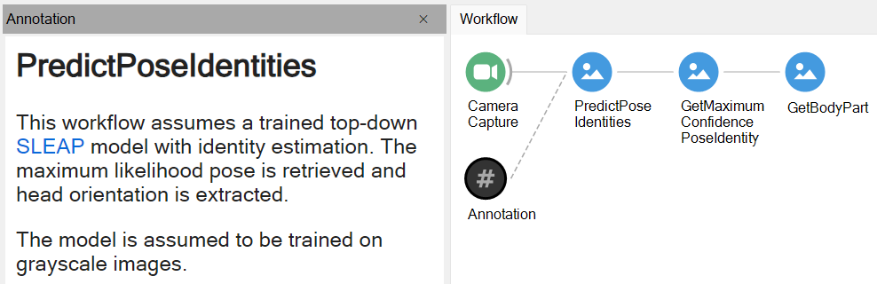
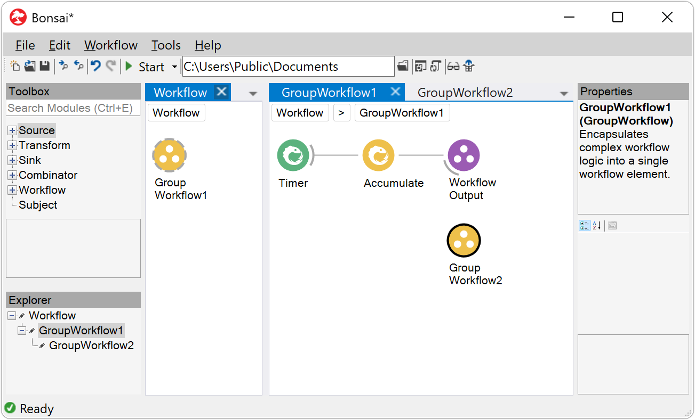
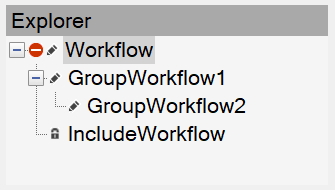
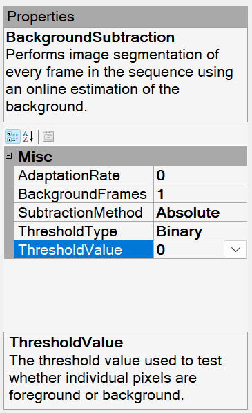

# Workflow Editor

When Bonsai starts you will be taken directly to the workflow editor. This is where you can create, configure, and run Bonsai workflows. The editor is composed of four main panels: [`Toolbox`](#toolbox), [`Workflow`](#workflow), [`Explorer`](#explorer) and [`Properties`](#properties). These are described in more detail below.

## Toolbox

The `Toolbox` allows you to search for available operators to place in the workflow. The listing is organized into six main categories:

| Category                                        | Description                                           |
| :---------------------------------------------: | ----------------------------------------------------- |
|          | generate event streams from devices or files          |
|    | convert or process individual data items              |
|              | save data or trigger external outputs                 |
|  | manage control flow or synchronize parallel inputs    |
|      | reusable workflow fragments stored in `.bonsai` files |
|        | access named event streams defined in the workflow    |

Operators inside each major category are further organized by namespaces linked to the packages you have installed. The name of each namespace can give you a hint about what kind of operations or devices can be accessed inside (e.g. the [`Audio`](xref:Bonsai.Audio) namespace provides access to audio capture devices or WAV file readers).

Once you have found which operator you want to insert, you can place it by double-clicking, dragging it to the workflow or alternatively right-clicking and selecting a specific placement option. See the [Actions and Shortcuts](#actions-and-shortcuts) section for more information.

### Search Operators

Another way to quickly find operators is to use the `Search` textbox. Any text inserted here is matched against available operators, subjects, or namespaces for a match in any order. This means you can search not only for a specific operator name but also by category names to locate all the operators in a namespace (e.g. try typing `Arduino`).

> [!Tip]
> You can directly type and search for operator names when the `Workflow` panel has the input focus. This allows you to simply start typing an operator name and directly select which operator you want with the up/down arrow keys. Once you have the right operator, press the <kbd>Enter</kbd> key to place it. You can repeat the process multiple times to very quickly chain a sequence of operators.

Another useful function of the `Search` textbox is to find existing instances of the selected toolbox operator in the workflow. Once you select an operator in the toolbox, you can use the `Find Next` or `Find Previous` commands to jump into the next instance of the operator, subject, or workflow extension, starting from the current cursor position. You can also right-click on an operator in the toolbox and select `Find All References` to list all instances of the operator in the workflow.

> [!Tip]
> You can browse through the reference documentation to learn more about each operator in the `Toolbox` by pressing <kbd>F1</kbd> or selecting `View Help` from the context menu.

## Workflow

The `Workflow` panel is where you combine different operators together to create data processing pipelines. Each operator is represented by a circular node. Nodes can be connected together, forming a directed feedforward graph from left to right. Connections going into a node indicate which operators that node subscribes to (see the [Language Guide](xref:observables) for an extended discussion).

The most useful action to learn your way around the `Workflow` panel is right-clicking. This will bring up the context menu for the specific node you selected, or a list of possible actions you can do with the current selection.

If only one node is selected, the `Output` menu item will display the type of the elements emitted by that operator sequence.

> [!Tip]
> If the output of an operator is a complex type, you can inspect its public data members. Clicking on any of the sub-items will automatically place a new [`MemberSelector`](xref:Bonsai.Expressions.MemberSelectorBuilder) operator to pick the specified data member from the output of the node.

The context menu also allows you to externalize public properties of the operator as explicit nodes in the workflow using the `Externalize Property` drop-down menu. Once a property is externalized, you can connect other nodes in the workflow to it so you can change the value of the property dynamically (see the [Property Mapping](xref:property-mapping) section for more information).

Finally, it is possible to group nodes, both for organizing large workflows, and to define [higher-order operators](xref:higher-order). The most basic grouping is the [`GroupWorkflow`](xref:Bonsai.Expressions.GroupWorkflowBuilder) which allows you to encapsulate a workflow fragment inside a single node. Any group can be assigned a `Name` for ease of reference and a `Description` for documentation. Any named properties which are externalized from nodes inside the group will be shown as properties of the group node itself on the top-level workflow.

> [!Note]
> You can use `GroupWorkflow` nodes to document your workflow by adding names and descriptions inline with operator chains. These can help readability of a workflow and no additional processing cost is incurred by the use of `GroupWorkflow` nodes.

### Type Visualizers

Type visualizers allow you to inspect online the data that is generated from a specific node during the execution of the workflow. They are useful to visualize the result of specific operations or to debug the behaviour of the workflow itself.

#### Assigning visualizers

Types can have more than one visualizer. You can choose the active type visualizer for a specific operator by right-clicking on the corresponding node and selecting from the available options in the `Show Visualizer` menu.

For example, image streams can be displayed on the screen using the default image visualizer, but you can also select the text visualizer to inspect image parameters such as size, or pixel bit depth. New visualizers can be added by installing new packages.

#### Visualizer layout settings

If you leave one or more visualizers open when you stop the workflow, the editor will memorize the position and size of each active window. When you run the workflow again, the same visualizer windows will be opened following the memorized layout. These settings are stored in a `.layout` file within the `.bonsai` settings folder, allowing them to persist between editor sessions.

> [!Tip]
> Many visualizers allow you to access more detailed information or advanced configuration parameters by right-clicking on the visualizer window.

### Annotations

As workflows become more complex, it can be helpful to add labels, comments, or detailed instructions. Bonsai provides a unique [`Annotation`](xref:Bonsai.Expressions.AnnotationBuilder) operator that can be placed on its own or attached to individual nodes and workflow sections. Annotations can be written in plain text or in [Markdown](https://www.markdownguide.org/), a simple formatting language that makes it easy to add rich content such as [headings, lists, links and images](https://www.markdownguide.org/basic-syntax/). 

To use annotations, search for the [`Annotation`](xref:Bonsai.Expressions.AnnotationBuilder) operator in the toolbox and add it to the workflow. You can rename the annotation in the property grid. To open the text editor, right-click the operator and select `Show Default Editor`. Double-click the operator to view the formatted annotation. Like other operators, annotations are part of the workflow and are saved in the `.bonsai` file.

> [!Warning]
> Images are not saved in the `.bonsai` file. To ensure accessibility when linking images, consider keeping them in the same folder as the workflow.

### Workflow Extensions

You can create and save workflow extensions by selecting one or more nodes and clicking the `Save Workflow As...` button in the context menu.

Workflow extensions are a powerful way to reuse common workflow patterns across a large project. When you save a new extension it will immediately show up in the `Toolbox` panel for placement. Placing a workflow extension will create a new [`IncludeWorkflow`](xref:Bonsai.Expressions.IncludeWorkflowBuilder) operator pointing to the saved workflow. You can place an extension multiple times in the same workflow.

> [!Tip]
> Like other groups, any named properties which are externalized from nodes inside the `IncludeWorkflow` will be shown as properties of the include node itself. These properties can have different values across different instances of the same workflow extension, and will be saved as part of the top-level workflow.

All included workflow extensions are read-only, meaning that you cannot change the internal structure of the extension once it is loaded into the workflow, only its properties. If you want to change the implementation of the extension you need to first `Ungroup` the `IncludeWorkflow` operator. This will make a copy of the included workflow and place it inside a [`GroupWorkflow`](xref:Bonsai.Expressions.GroupWorkflowBuilder). From there you will be able to modify the internal implementation at will. After you have changed the structure, you can save the extension again using `Save Workflow As...`.

> [!Warning]
> When you change the structure of an included workflow and save it over the original file, all references to that workflow extension will be automatically reloaded and updated. This ensures that all references to the same extension remain consistent throughout.

### Watch Mode

To assist with debugging workflows, you can enable watch mode on individual nodes by selecting an operator and clicking on `Toggle Watch` in the toolbar. The watch mode provides runtime feedback on whether the operator has an active subscription from a downstream operator, is emitting values, or whether its subscriptions have terminated. Each status is visually annotated with a symbol displayed adjacent to the operator.

| Status    | Annotation                                                                | Description |
| --------- | ----------------------------------------------------------------------    | ----------- |
| Ready     | {width=40}         | No subscriptions have yet been made |
| Active    | {width=40}       | At least one active subscription but no values have been emitted yet |
| Notifying | {width=40} | At least one active subscription and emitted at least one value in the last period |
| Completed | {width=40} | No active subscriptions and at least one subscription terminated successfully |
| Error     | {width=40}     | No active subscriptions and at least one subscription terminated exceptionally |
| Canceled  | {width=40}   | No active subscriptions and at least one subscription was canceled without termination |

> [!WARNING]
> The watch mode refreshes at a maximum rate of 10 Hz and should not be relied upon to evaluate aspects of workflow behaviour that rely on precise timing.

> [!WARNING]
> As the watch mode does not currently track individual subscriptions, care must be taken when interpreting multiple parallel subscriptions, as the true state of each one may be obscured.

### Navigation and Layout

You can take advantage of tabs, windows, breadcrumbs and docked panels to navigate complex nested workflows and organize your workspace.

Right-clicking on a nested node such as a [`GroupWorkflow`](xref:Bonsai.Expressions.GroupWorkflowBuilder) will bring up the context menu, where you can select the `Open in New Tab` or `Open in New Window` commands. You can also access these commands by right-clicking on the tab header or window title bar.

Each tab or window displays a breadcrumb trail at the top, indicating the location of the current view within the nested workflows. Clicking a breadcrumb switches the view to the corresponding workflow, allowing you to navigate between levels.

You can further organize tabs and windows by rearranging them into docked panels. To do this, click and drag a tab header or window title bar towards the center of the screen. A docking guide overlay will appear, allowing you to position the panel in different regions of the workspace. Once the panel has been placed, you can reposition the borders of the panel, as well as create new tabs.

## Explorer

{width=300} 

The `Explorer` panel also supports workflow navigation by providing a hierarchical tree view, similar to a file browser. Each level in the tree corresponds to a nested node. Selecting a node will update the `Workflow` panel view to display the corresponding nested workflow. You can also navigate the tree by using the keyboard arrow keys and pressing <kbd>Enter</kbd> to update the view. To open the node in a new tab or window, right-click on the node label and select one of the options. To expand or collapse the tree view at any level, click on the `+` or `-` icon to the left of the node label, or double-click the label itself. Icons adjacent to each label indicate the status of the corresponding workflow:

- ✏️ Editable workflow
- 🔒 Locked workflow (`IncludeWorkflow`)
- ⛔ Workflow contains errors

## Properties

{width=300} 

Each operator exposes a set of configuration properties that parameterize the operator's behaviour (e.g., the [`Timer`](xref:Bonsai.Reactive.Timer) operator exposes the period between generated values, whereas an image [`Threshold`](xref:Bonsai.Vision.Threshold) exposes the brightness cutoff value applied to individual pixels).

The `Properties` panel will display all the configuration properties which are available for the currently selected operator. A summary description of the currently selected property can be found in the textbox at the bottom of the panel. Similarly, a description of the behaviour of the currently selected operator itself is shown at the top of the panel.

Most properties can be configured simply by changing the text value in the corresponding row of the property grid. Some properties have further specialized editors which can be accessed by clicking the drop-down or dialog button which will be displayed to the right of the property text.

> [!Note]
> Some operators have even more specialized editor windows such as camera configuration dialogs or media player controls. If such property pages exist for the currently selected operator, the small `Property Pages` button () above the property grid will become active.

## Actions and Shortcuts

> [!TIP]
> As previously mentioned, right-clicking to bring up the context menu is the most useful action to discover a list of available commands, which will vary depending on the  editor panel you right-click in and the current selection.

Below is a summary of the most used actions and shortcuts in the workflow editor:

# [Mouse Controls](#tab/mouse-controls)

| Action                             | Mouse Controls |
| ---------------------------------- | -------------- | 
| Insert operator                    | In the `Toolbox` panel, choose any of these options: <li> Select the operator, drag-and-drop to the `Workflow` panel <li> Right-click the operator,  select either of the `Insert` options <li> Double-click the operator    By default the operator will be placed after a node that is selected in the `Workflow` panel. If a connection can be formed, the two nodes will be connected.    To insert the operator before a selected node, hold down the <kbd>Shift</kbd> key together with any of the above actions. |
| Replace operator                   | In the `Toolbox` panel: <li> With a node already selected in the `Workflow` panel, right-click the operator and select `Replace` |
| Remove operator                    | In the `Workflow` panel: <li> Right-click the operator,  select `Remove` |
| Move or duplicate operator         | In the `Workflow` panel: <li> Right-click the operator, select `Cut` or `Copy`<li> Right-click another node or anywhere else in the panel, select `Paste` |
| Create branch                      | In the `Toolbox` panel: <li> With a node already selected in the `Workflow` panel,  right-click the operator and select `Create Branch` |
| Connect operators                  | In the `Workflow` panel, choose any of these options: <li> Right-click the source node, select `Create Connection` and left-click on the target node <li> Drag the source node and drop it on the target node |
| Disconnect operators               | In the `Workflow` panel, choose any of these options: <li> Right-click the source node, select `Remove Connection` and left-click on the target node <li> Hold down <kbd>Shift</kbd>, drag the source node and drop it on the target node |
| Reorder operators                  | In the `Workflow` panel: <li> Right-click the source node, select `Reorder Connection` and left-click on the target node |
| Select multiple nodes              | In the `Workflow` panel: <li> Click on an empty space and drag a box around the nodes to be selected    Hold <kbd>Ctrl</kbd> while clicking on a node to add/remove it from the current selection.    Many operations can be performed on multi-node selections or node groups (e.g., delete, create connections, create a node group, etc.). |
| Group operators                    | In the `Workflow` panel: <li> Right-click on a multi-node selection and select a group type from the `Group` dropdown    On an existing node group, you can do the same action to change the group type. |
| Ungroup node group                 | In the `Workflow` panel: <li> Right-click on the group node and select `Ungroup` |
| Open operator editor or node group | In the `Workflow` panel, choose any of these options: <li> When workflow is not running: double-click <li> When workflow is running: <kbd>Ctrl</kbd> + double-click |
| Open visualizer                    | In the `Workflow` panel, choose any of these options: <li> Double-click on the target node <li> Right-click on the target node and select a visualizer from the `Show Visualizer` dropdown    This action is only available when the workflow is running. |
| Disable node                       | In the `Workflow` panel: <li> Right-click on the node and select `Disable` |
| Enable node                        | In the `Workflow` panel: <li> Right-click on the node and select `Enable` |
| Toggle watch                       | In the `Workflow` panel, choose any of these options: <li> Select the node, click on the `Toggle Watch` button in the toolbar <li> Right-click the node and select `Toggle Watch` from the context menu |
| New tab or window                  | In the `Workflow` panel, choose any of these options: <li> Right-click the tab/window bar, select either of the `Open` options <li> Right-click the node, select either of the `Open` options    In the `Explorer` panel: <li> Right-click the nested node label, select either of the `Open` options |
| Find node                          | In the `Toolbox` panel: <li> Search for the operator, right-click on it and choose any of the `Find` options    In the `Workflow Panel`, choose any of these options: <li> Select the node and click on the `Find Next` and `Find Previous` buttons in the `Toolbar` <li> Right-click the node and select `Find All References` |
| View help                          | In the `Workflow` panel: <li> Right-click on the operator and select `View Help` |
| Go to definition                   | In the `Workflow` panel: <li> Right-click on the operator and select `Go To Definition` |

# [Keyboard Controls](#tab/keyboard-controls)

| Action                             | Keyboard Controls |
| ---------------------------------- | ----------------- | 
| New workflow                       | <kbd>Ctrl</kbd>+<kbd>Shift</kbd>+<kbd>N</kbd> |
| Open workflow                      | <kbd>Ctrl</kbd>+<kbd>O</kbd> |
| Save workflow                      | <kbd>Ctrl</kbd>+<kbd>S</kbd> |
| Save workflow extension            | <kbd>Ctrl</kbd>+<kbd>Shift</kbd>+<kbd>S</kbd> |
| Start workflow                     | <kbd>F5</kbd> |
| Start workflow without debugging   | <kbd>Ctrl</kbd>+<kbd>F5</kbd> |
| Stop workflow                      | <kbd>Shift</kbd>+<kbd>F5</kbd> |
| Export Image                       | <kbd>Ctrl</kbd>+<kbd>Shift</kbd>+<kbd>E</kbd> |
| Copy Image                         | <kbd>Ctrl</kbd>+<kbd>Shift</kbd>+<kbd>C</kbd> |
| Undo action                        | <kbd>Ctrl</kbd>+<kbd>Z</kbd> |
| Redo action                        | <kbd>Ctrl</kbd>+<kbd>Y</kbd> |
| Insert operator                    | Insert after selected node: <kbd>Enter</kbd>   Insert before selected node: <kbd>Shift</kbd>+<kbd>Enter</kbd> |
| Replace operator                   | <kbd>Ctrl</kbd>+<kbd>Alt</kbd>+<kbd>Enter</kbd> |
| Remove operator                    | <kbd>Del</kbd> |
| Move or duplicate operator         | Cut: <kbd>Ctrl</kbd>+<kbd>X</kbd>   Copy: <kbd>Ctrl</kbd>+<kbd>C</kbd>   Paste after selected node: <kbd>Ctrl</kbd>+<kbd>V</kbd>   Paste before selected node: <kbd>Shift</kbd>+<kbd>Ctrl</kbd>+<kbd>V</kbd> |
| Create branch                      | <kbd>Alt</kbd> + an existing shortcut for inserting a new operator   e.g., <kbd>Alt</kbd>+<kbd>Ctrl</kbd>+<kbd>V</kbd> |
| Select multiple nodes              | <kbd>Shift</kbd>+[ <kbd>↑</kbd> / <kbd>↓</kbd> / <kbd>←</kbd> / <kbd>→</kbd> ] |
| Select all nodes                   | <kbd>Ctrl</kbd>+<kbd>A</kbd> |
| Group operators                    | <kbd>Ctrl</kbd>+<kbd>G</kbd> |
| Ungroup node group                 | <kbd>Ctrl</kbd>+<kbd>Shift</kbd>+<kbd>G</kbd> |
| Open operator editor or node group | Workflow not running: <kbd>Enter</kbd>   Workflow running: <kbd>Ctrl</kbd>+<kbd>Enter</kbd> |
| Open visualizer                    | <kbd>Enter</kbd>   This action is only available when the workflow is running. |
| Close editor/visualizer            | <kbd>Esc</kbd> |
| Disable node                       | <kbd>Ctrl</kbd>+<kbd>D</kbd> |
| Enable node                        | <kbd>Shift</kbd>+<kbd>Ctrl</kbd>+<kbd>D</kbd> |
| Toggle watch                       | <kbd>Shift</kbd>+<kbd>F9</kbd> |
| New tab or window                  | Tab: <kbd>Ctrl</kbd>+<kbd>T</kbd>   Window: <kbd>Ctrl</kbd>+<kbd>N</kbd> |
| Close tab or window                | <kbd>Ctrl</kbd>+<kbd>F4</kbd> |
| Find node                          | Find next: <kbd>F3</kbd>   Find previous: <kbd>Shift</kbd>+<kbd>F3</kbd>   Find all references: <kbd>Shift</kbd>+<kbd>F12</kbd> |
| Find visualizer source             | With the visualizer highlighted: <kbd>Ctrl</kbd>+<kbd>Backspace</kbd> |
| Open context menu                  | <kbd>Shift</kbd>+<kbd>F10</kbd> |
| View help                          | <kbd>F1</kbd> |
| Go to definition                   | <kbd>F12</kbd> |